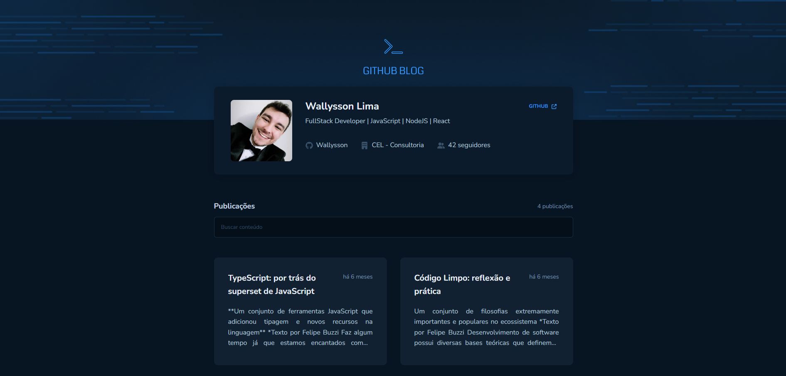
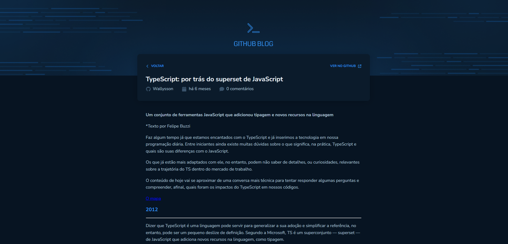

  
  
  
  
  
  

# 💻 Blog Github

Este projeto usa o React para criar a interface do meu usuário para interagir com a API do Github. O usuário pode pesquisar por Issues, visualizar as informações detalhadas quando selecionado e visualizado em MarkDown.  
A interface do usuário foi construída usando o React, com componentes para exibir resultados de pesquisa e informações detalhadas das issues. A API do Github é usada para buscar informações sobre perfil e atividades do usuário.  
Os usuários podem clicar em uma issue específica para ver informações mais detalhadas, como o número de comentário, quem criou e tempo da publicação.

## 🚀 Tecnologias

- [ReactJS](https://reactjs.org/)
- [TypeScript](https://www.typescriptlang.org/)
- [Axios](https://axios-http.com/ptbr/docs/intro)
- [ReactHookForm](https://react-hook-form.com/)
- [MomentJS](https://momentjs.com/)
- [ReactMarkdown](https://github.com/remarkjs/react-markdown)
- [FontAwesome](https://fontawesome.com/)

## 📑 Features

- Pesquisa de issues: permitir que os usuários pesquisem issues de um repositório específico usando palavras-chave, filtros e ordenação;
- Listagem de issues: exibir uma lista de issues encontradas;
- Detalhes da issues: permitir que os usuários possam navegar entre o blog para acompanhar os artigos;
- Visualização de perfil: permitir que os usuários visualizem informações do perfil do Github, como nome de usuário, foto de perfil, biografia e followers;
- Interface intuitiva: criar uma interface fácil de usar e intuitiva, com uma navegação clara e recursos de ajuda para ajudar os usuários a entender como utilizar a aplicação.

## 🖼️ Previews

### Web

| Home Blog Github                             | Detalhe                                        |
| -------------------------------------------- | ---------------------------------------------- |
|  |  |
